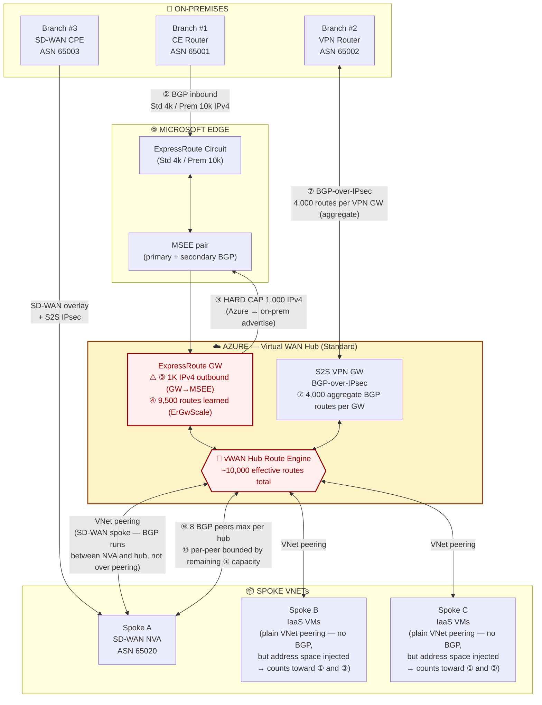
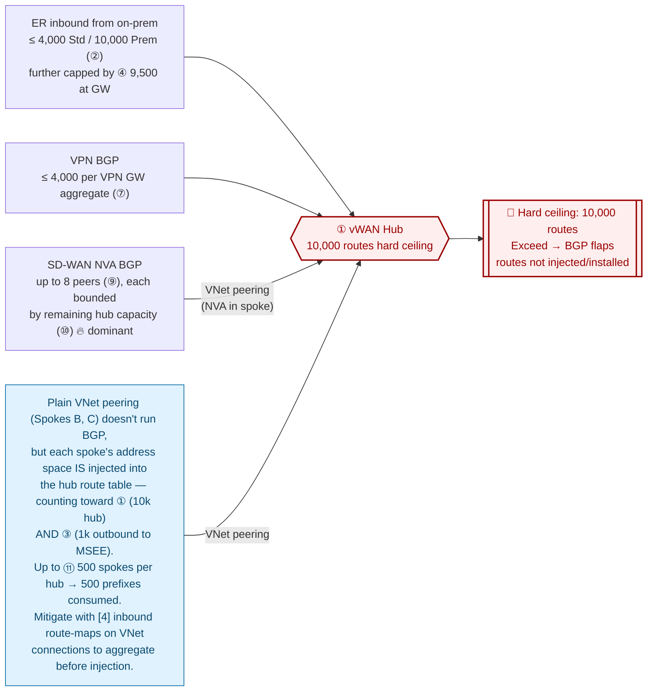
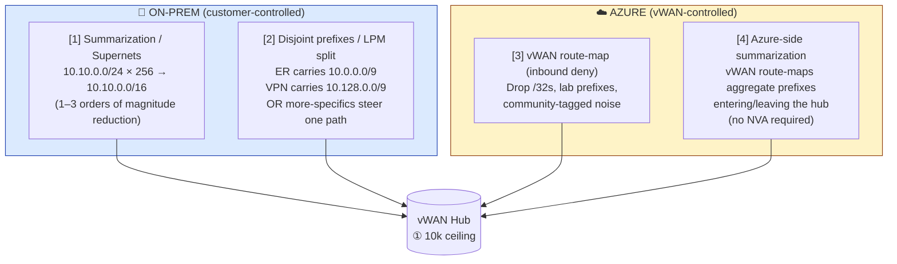

# Azure Virtual WAN — Routing Limits & Mitigation Playbook

> This document provides a structured analysis of routing constraints in an Azure Virtual WAN deployment that integrates ExpressRoute, BGP-over-IPsec site-to-site VPN, and a spoke-hosted SD-WAN network virtual appliance (NVA). Each contention point in the data and control plane is examined to identify where route advertisements may be discarded, capped, or fail to install, and corresponding mitigation strategies are presented for both the on-premises and Azure-side components of the architecture.

---

## Table of Contents
- [Topology](#topology)
- [Route-Limit Cheat Sheet](#route-limit-cheat-sheet)
- [Where the Routes Pile Up](#where-the-routes-pile-up)
- [Mitigation Playbook](#mitigation-playbook)
- [Validation Commands](#validation-commands)
- [References (Official Microsoft Docs)](#references-official-microsoft-docs)

---

## Topology

Three on-prem branches converge on a single Standard vWAN hub via three different control planes, plus two regular IaaS spokes.



---

## Route-Limit Cheat Sheet

All limits below cite the official Microsoft documentation — see [References](#references-official-microsoft-docs) for direct links.

| # | Contention Point | Limit (per Microsoft docs) | Failure Mode |
|---|---|---|---|
| ① | **vWAN hub route engine** | **10,000 routes total** the hub can accept from all connected resources (VNets, branches, other hubs, NVAs) | BGP flaps; routes not injected/installed |
| ② | **CE → MSEE (ER circuit, private peering)** | **4,000 IPv4 (Local/Standard)** / **10,000 IPv4 (Premium)** ; **100 IPv6** ; **200** to Microsoft peering | Circuit BGP session drops |
| ③ | **ER Gateway → MSEE (outbound)** ⚠️ | **1,000 IPv4** / **100 IPv6** VNet routes advertised by the GW to the circuit | ER GW BGP drops → ER attachment down |
| ④ | **ER Gateway inbound route learning** | Std/ERGw1Az: **4,000** ; HighPerf/ERGw2Az: **9,500** ; Ultra/ErGw3Az: **9,500** ; **ErGwScale (vWAN): 9,500 total per GW** | Routes truncated; BGP may drop |
| ⑤ | **ER circuit connections per hub** | **8 circuits** per hub | Cannot attach more |
| ⑥ | **VPN (branch) connections per hub** | **1,000** | Cannot connect more branches |
| ⑦ | **Aggregate BGP routes per VPN gateway** | **4,000** per VPN gateway (not per session) | Routes truncated; session may drop |
| ⑧ | **Local Network Gateway prefixes (per LNG)** | **1,000** | Extra prefixes ignored |
| ⑨ | **NVA-in-spoke BGP peers per vWAN hub** | **8 peers max** (hub-wide) | Cannot add more peers |
| ⑩ | **Routes per NVA BGP peer** | Bounded by remaining ① capacity. Example from docs: if hub already holds 6,000 routes, a new NVA peer can advertise only 4,000 | Routes truncated; BGP flaps |
| ⑪ | **VNet connections per hub** (no Routing Intent) | **500 minus total number of hubs** in the Virtual WAN | Cannot attach more spokes |
| ⑫ | **Address spaces per hub** (with Routing Intent + private policies) | **600 per hub** across all directly connected VNets | Extra address spaces not advertised |

> ⚠️ The **ER Gateway → MSEE** hop (③) is the **most under-appreciated cap** — the GW can only advertise **1,000 IPv4 prefixes** out to the MSEE, regardless of the circuit SKU. Exceed it and the BGP session drops — taking the whole ER attachment with it, even on a Premium 10k circuit.

---

## Where the Routes Pile Up



Worst-case if every BGP source advertises at its cap (Premium ER) → ~24,000 routes converging on a **10,000-route hard ceiling**. Once the hub exceeds 10k, **BGP sessions flap and routes are not injected or installed** — silent reachability loss. **Filtering at ingress is mandatory, not optional.**

> 📌 **Spoke VNet address spaces count too.** Plain VNet peering doesn't run BGP, but each connected spoke's address space **is injected into the hub route table** and **re-advertised out the ER GW to the MSEE**, where it consumes a slot in the **1,000 IPv4 outbound cap (③)**. With up to **500 spokes per hub (⑪)**, that's potentially **500 prefixes** burned on Azure-side advertisements before any on-prem-bound traffic engineering. Mitigate with **[4] inbound route-maps on VNet connections** to aggregate spoke prefixes (e.g., collapse 50 spoke /24s into one /16) before they enter the hub route table.

---

## Mitigation Playbook

### Two sides, four levers



### Lever Details

| # | Lever | Where | Mechanism | Trade-off |
|---|---|---|---|---|
| **[1]** | **Summarization / supernets** | On-prem CE | Aggregate contiguous prefixes (e.g. 256 × /24 → 1 × /16) | Requires disciplined IPAM; M&A sprawl breaks aggregation |
| **[2]** | **Disjoint prefixes / LPM split** | On-prem CE / SD-WAN | Each path carries a different slice of address space, or use more-specifics to steer | Failover must be planned — who covers the gap if a path drops? |
| **[3]** | **vWAN route-map (inbound)** | Azure hub connection | Deny by prefix, AS-path, or BGP community at the hub ingress | Per-connection config; easy to miss one ingress |
| **[4]** | **Azure-side summarization (route-maps)** | vWAN hub connection (inbound or outbound) | Native vWAN route-maps aggregate prefixes — no NVA needed. See [route-maps overview](https://learn.microsoft.com/azure/virtual-wan/route-maps-about) | Loses granularity for troubleshooting and failover |

### Per-Path Recommendation

| Path | On-prem lever | Azure lever |
|---|---|---|
| **ER GW → MSEE** (③ 1k cap on Azure-advertised prefixes) | — (this is Azure-side) | **[4]** Apply **inbound route-maps on VNet connections** to aggregate spoke prefixes (e.g., 50 × /24 → 1 × /16) **before they are re-advertised out the ER GW to the MSEE** — each aggregated prefix consumes one slot in the 1k outbound cap instead of many; critical when approaching ⑪ 500 spokes/hub. **[3]** deny /32s and host routes |
| **On-prem CE → MSEE** (② 4k Std / 10k Prem) | **[1]** Summarize aggressively on-prem (or advertise supernets toward Azure) | **[3]** Inbound route-map on the ER connection to block unwanted prefixes; **[4]** inbound route-map to aggregate incoming prefixes before they enter the hub route table |
| **VPN → VPN GW** (⑦ 4k aggregate per VPN GW) | **[1]** Aggregate prefix advertisements from on-prem CE / VPN concentrator toward Azure (supernets where possible) | **[3]** Inbound route-map on the VPN connection to drop unwanted prefixes; **[4]** inbound route-map to aggregate incoming prefixes before they enter the hub route table |
| **SD-WAN NVA → vHub** (⑨ 8 peers; ⑩ per-peer bounded by remaining ① capacity) | **[1]** Aggregate overlay prefix advertisements on the SD-WAN device toward Azure (supernets where possible) | **[3]** Inbound route-map on the NVA BGP connection to drop unwanted prefixes; **[4]** inbound route-map to aggregate incoming prefixes before they enter the hub route table |
| **Hub → spokes & branches** | — | **[4]** Use vWAN route-maps to re-aggregate prefixes before advertising out (reduces branch device RIB load) |

### Golden Rule

> **Filter as close to the source as possible.** Every prefix stopped on-prem is a prefix that never consumes a slot at ③ (1k outbound), ④ (9,500 ER GW learned), ⑦ (4k VPN GW aggregate), or ① (10k hub ceiling). Azure-side route-maps are your **safety net**, not your primary defense.

---

## Validation Commands

```bash
# Effective routes on a VNet/ER/VPN connection
az network vhub get-effective-routes \
  --resource-group rg-net --name vhub-eastus \
  --resource-type ExpressRouteConnection \
  --resource-id <er-connection-id>

# Routes learned by ER gateway from the circuit (check against 1,000 cap)
az network express-route list-route-tables \
  -g rg-hybrid -n er-circuit-eastus \
  --peering-name AzurePrivatePeering --path primary \
  --query "length(value)"

# Routes learned by the VPN gateway
az network vpn-gateway list-learned-routes \
  -g rg-hybrid -n vpngw-vhub-eastus

# BGP peers on the hub (includes SD-WAN NVA peers)
az network vhub bgpconnection list \
  -g rg-net --vhub-name vhub-eastus

# Routing intent / route-map config
az network vhub connection show \
  -g rg-net --vhub-name vhub-eastus \
  -n conn-er-branch1 --query "routingConfiguration"
```

---

## References (Official Microsoft Docs)

### Virtual WAN Limits & Routing
- [Virtual WAN FAQ — limits & scale](https://learn.microsoft.com/azure/virtual-wan/virtual-wan-faq)
- [Azure subscription & service limits — Virtual WAN](https://learn.microsoft.com/azure/azure-resource-manager/management/azure-subscription-service-limits#virtual-wan-limits)
- [About virtual hub routing](https://learn.microsoft.com/azure/virtual-wan/about-virtual-hub-routing)
- [How to configure virtual hub routing](https://learn.microsoft.com/azure/virtual-wan/how-to-virtual-hub-routing)
- [Routing intent and routing policies](https://learn.microsoft.com/azure/virtual-wan/how-to-routing-policies)
- [Route-maps for Virtual WAN](https://learn.microsoft.com/azure/virtual-wan/route-maps-about) ← **the [3] lever**
- [How to configure route-maps](https://learn.microsoft.com/azure/virtual-wan/route-maps-how-to)

### ExpressRoute
- [ExpressRoute circuits & routing domains](https://learn.microsoft.com/azure/expressroute/expressroute-circuit-peerings)
- [ExpressRoute routing requirements (including prefix limits)](https://learn.microsoft.com/azure/expressroute/expressroute-routing)
- [About ExpressRoute virtual network gateways](https://learn.microsoft.com/azure/expressroute/expressroute-about-virtual-network-gateways) ← **1,000 prefix MSEE→GW cap noted here**
- [ExpressRoute FAQ](https://learn.microsoft.com/azure/expressroute/expressroute-faqs)

### S2S VPN & BGP
- [About BGP with Azure VPN Gateway](https://learn.microsoft.com/azure/vpn-gateway/vpn-gateway-bgp-overview)
- [VPN Gateway FAQ](https://learn.microsoft.com/azure/vpn-gateway/vpn-gateway-vpn-faq)
- [Create a S2S VPN connection in Virtual WAN](https://learn.microsoft.com/azure/virtual-wan/virtual-wan-site-to-site-portal)

### SD-WAN / NVA BGP Peering with vWAN Hub
- [Scenario: BGP peering with a virtual hub](https://learn.microsoft.com/azure/virtual-wan/scenario-bgp-peering-hub)
- [How to configure BGP peering with a virtual hub](https://learn.microsoft.com/azure/virtual-wan/create-bgp-peering-hub-portal)
- [About NVAs in a virtual hub (partner SD-WAN)](https://learn.microsoft.com/azure/virtual-wan/about-nva-hub)

### Route Summarization & BGP Design
- [Configure BGP on Azure VPN Gateway](https://learn.microsoft.com/azure/vpn-gateway/bgp-howto)
- [Microsoft Azure Well-Architected Framework — Networking](https://learn.microsoft.com/azure/well-architected/service-guides/virtual-network)
- [Cloud Adoption Framework — Network topology and connectivity](https://learn.microsoft.com/azure/cloud-adoption-framework/ready/azure-best-practices/network-topology-and-connectivity)

---

## License

MIT — see [LICENSE](LICENSE).
