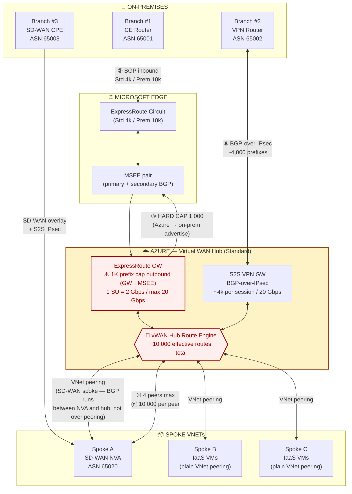
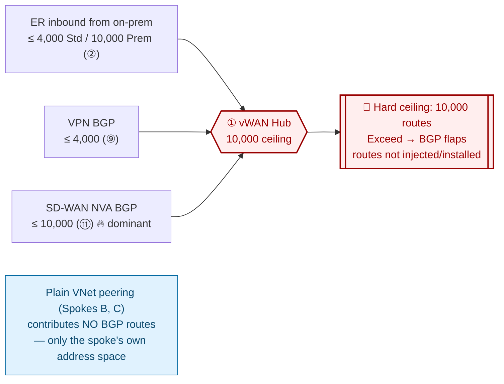
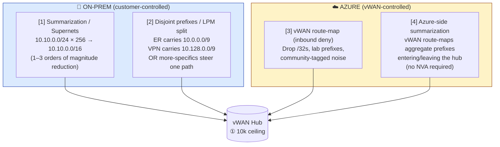

# Azure Virtual WAN — Routing Limits & Mitigation Playbook

> A practical, contention-point-by-contention-point guide to understanding **where routes are dropped, throttled, or silently lost** in a multi-branch Azure Virtual WAN deployment combining **ExpressRoute, BGP-over-IPsec S2S VPN, and an SD-WAN NVA in a spoke VNet** — and how to mitigate the limits from both the on-prem and Azure sides.

---

## Table of Contents
- [Topology](#topology)
- [Route-Limit Cheat Sheet](#route-limit-cheat-sheet)
- [Where the Routes Pile Up](#where-the-routes-pile-up)
- [Mitigation Playbook](#mitigation-playbook)
- [Validation Commands](#validation-commands)
- [References (Official Microsoft Docs)](#references-official-microsoft-docs)

---

## Topology

Three on-prem branches converge on a single Standard vWAN hub via three different control planes, plus two regular IaaS spokes.



---

## Route-Limit Cheat Sheet

| # | Contention Point | Limit | Failure Mode |
|---|---|---|---|
| ① | **vWAN hub route engine** | **~10,000 effective routes** total | Silent route drops, asymmetric paths |
| ② | **CE → MSEE (ER circuit)** | **4,000 (Std)** / **10,000 (Prem)** prefixes | Circuit BGP session drops |
| ③ | **ER Gateway → MSEE** ⚠️ | **1,000 prefixes** hard cap (Azure-side routes advertised out to on-prem) | ER GW BGP drops → whole ER attachment down |
| ④ | **ER GW scale units** | 1 SU = 2 Gbps, max 10 SU = 20 Gbps | Throughput throttled |
| ⑤ | **ER connections per hub** | 8 circuits | Cannot attach more |
| ⑥ | **VPN GW scale units** | 1 SU = 500 Mbps, max 20 SU = 20 Gbps | Throughput throttled |
| ⑦ | **VPN sites per hub** | 1,000 sites | Cannot connect more branches |
| ⑧ | **BGP peers per VPN link** | 2 (1 per tunnel) | — |
| ⑨ | **Prefixes per VPN BGP session** | ~4,000 | Session drops |
| ⑩ | **VNet-NVA BGP peers per hub** | **4 peers max** | Cannot add more SD-WAN peers |
| ⑪ | **Routes per NVA BGP peer** | 10,000 (still capped by ①) | Routes truncated |
| ⑫ | **VNet connections per hub** | 500 | Cannot attach more spokes |
| ⑬ | **Prefixes per VNet connection** | 200 | Extra prefixes ignored |

> ⚠️ The **ER Gateway → MSEE** hop (③) is the **most under-appreciated cap** — it's tighter than the circuit itself. The ER GW can only advertise up to **1,000 Azure-side prefixes** out to the MSEE. Exceed it and the BGP session drops — taking the whole ER attachment with it, regardless of whether you bought a Premium 10k circuit.

---

## Where the Routes Pile Up



Worst-case if every BGP source advertises at its cap (Premium ER) → ~24,000 routes converging on a **10,000-route hard ceiling**. Once the hub exceeds 10k, **BGP sessions flap and routes are not injected or installed** — silent reachability loss. **Filtering at ingress is mandatory, not optional.**

> Note: the **1K cap on the ER GW is outbound only** (GW → MSEE). It limits what Azure advertises *out* to on-prem — it does **not** bound how many on-prem routes the hub *receives*. Inbound from on-prem is bounded by the circuit SKU (② 4k Std / 10k Prem).

---

## Mitigation Playbook

### Two sides, four levers



### Lever Details

| # | Lever | Where | Mechanism | Trade-off |
|---|---|---|---|---|
| **[1]** | **Summarization / supernets** | On-prem CE | Aggregate contiguous prefixes (e.g. 256 × /24 → 1 × /16) | Requires disciplined IPAM; M&A sprawl breaks aggregation |
| **[2]** | **Disjoint prefixes / LPM split** | On-prem CE / SD-WAN | Each path carries a different slice of address space, or use more-specifics to steer | Failover must be planned — who covers the gap if a path drops? |
| **[3]** | **vWAN route-map (inbound)** | Azure hub connection | Deny by prefix, AS-path, or BGP community at the hub ingress | Per-connection config; easy to miss one ingress |
| **[4]** | **Azure-side summarization (route-maps)** | vWAN hub connection (inbound or outbound) | Native vWAN route-maps aggregate prefixes — no NVA needed. See [route-maps overview](https://learn.microsoft.com/azure/virtual-wan/route-maps-about) | Loses granularity for troubleshooting and failover |

### Per-Path Recommendation

| Path | On-prem lever | Azure lever |
|---|---|---|
| **ER GW → MSEE** (③ 1k cap on Azure-advertised prefixes) | — (this is Azure-side) | **[1][4]** Aggregate VNet/hub prefixes before re-advertise; **[3]** deny /32s |
| **On-prem CE → MSEE** (② 4k Std / 10k Prem) | **[1]** Summarize aggressively on-prem | **[3]** Deny /32s and host routes as safety net |
| **VPN → VPN GW** (~4k) | **[2]** Disjoint — VPN carries only branches NOT reachable via ER | **[3]** Deny anything overlapping ER advertisements |
| **SD-WAN NVA → vHub** (10k dominant) | **[1]** Summarize overlay prefixes at the NVA | **[3]** Community-match to drop SD-WAN routes duplicating ER/VPN |
| **Hub → spokes & branches** | — | **[4]** Use vWAN route-maps to re-aggregate prefixes before advertising out (reduces branch device RIB load) |

### Golden Rule

> **Filter as close to the source as possible.** Every prefix stopped on-prem is a prefix that never consumes a slot at ③ (1k), ⑨ (4k), ⑪ (10k), or ① (10k hub ceiling). Azure-side route-maps are your **safety net**, not your primary defense.

---

## Validation Commands

```bash
# Effective routes on a VNet/ER/VPN connection
az network vhub get-effective-routes \
  --resource-group rg-net --name vhub-eastus \
  --resource-type ExpressRouteConnection \
  --resource-id <er-connection-id>

# Routes learned by ER gateway from the circuit (check against 1,000 cap)
az network express-route list-route-tables \
  -g rg-hybrid -n er-circuit-eastus \
  --peering-name AzurePrivatePeering --path primary \
  --query "length(value)"

# Routes learned by the VPN gateway
az network vpn-gateway list-learned-routes \
  -g rg-hybrid -n vpngw-vhub-eastus

# BGP peers on the hub (includes SD-WAN NVA peers)
az network vhub bgpconnection list \
  -g rg-net --vhub-name vhub-eastus

# Routing intent / route-map config
az network vhub connection show \
  -g rg-net --vhub-name vhub-eastus \
  -n conn-er-branch1 --query "routingConfiguration"
```

---

## References (Official Microsoft Docs)

### Virtual WAN Limits & Routing
- [Virtual WAN FAQ — limits & scale](https://learn.microsoft.com/azure/virtual-wan/virtual-wan-faq)
- [Azure subscription & service limits — Virtual WAN](https://learn.microsoft.com/azure/azure-resource-manager/management/azure-subscription-service-limits#virtual-wan-limits)
- [About virtual hub routing](https://learn.microsoft.com/azure/virtual-wan/about-virtual-hub-routing)
- [How to configure virtual hub routing](https://learn.microsoft.com/azure/virtual-wan/how-to-virtual-hub-routing)
- [Routing intent and routing policies](https://learn.microsoft.com/azure/virtual-wan/how-to-routing-policies)
- [Route-maps for Virtual WAN](https://learn.microsoft.com/azure/virtual-wan/route-maps-about) ← **the [3] lever**
- [How to configure route-maps](https://learn.microsoft.com/azure/virtual-wan/route-maps-how-to)

### ExpressRoute
- [ExpressRoute circuits & routing domains](https://learn.microsoft.com/azure/expressroute/expressroute-circuit-peerings)
- [ExpressRoute routing requirements (including prefix limits)](https://learn.microsoft.com/azure/expressroute/expressroute-routing)
- [About ExpressRoute virtual network gateways](https://learn.microsoft.com/azure/expressroute/expressroute-about-virtual-network-gateways) ← **1,000 prefix MSEE→GW cap noted here**
- [ExpressRoute FAQ](https://learn.microsoft.com/azure/expressroute/expressroute-faqs)

### S2S VPN & BGP
- [About BGP with Azure VPN Gateway](https://learn.microsoft.com/azure/vpn-gateway/vpn-gateway-bgp-overview)
- [VPN Gateway FAQ](https://learn.microsoft.com/azure/vpn-gateway/vpn-gateway-vpn-faq)
- [Create a S2S VPN connection in Virtual WAN](https://learn.microsoft.com/azure/virtual-wan/virtual-wan-site-to-site-portal)

### SD-WAN / NVA BGP Peering with vWAN Hub
- [Scenario: BGP peering with a virtual hub](https://learn.microsoft.com/azure/virtual-wan/scenario-bgp-peering-hub)
- [How to configure BGP peering with a virtual hub](https://learn.microsoft.com/azure/virtual-wan/create-bgp-peering-hub-portal)
- [About NVAs in a virtual hub (partner SD-WAN)](https://learn.microsoft.com/azure/virtual-wan/about-nva-hub)

### Route Summarization & BGP Design
- [Configure BGP on Azure VPN Gateway](https://learn.microsoft.com/azure/vpn-gateway/bgp-howto)
- [Microsoft Azure Well-Architected Framework — Networking](https://learn.microsoft.com/azure/well-architected/service-guides/virtual-network)
- [Cloud Adoption Framework — Network topology and connectivity](https://learn.microsoft.com/azure/cloud-adoption-framework/ready/azure-best-practices/network-topology-and-connectivity)

---

## License

MIT — see [LICENSE](LICENSE).
